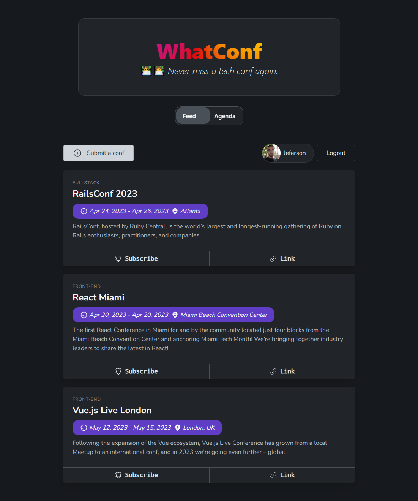

# WhatConf



## What is this project?

The idea originally came from a personal frustration of missing some tech conferences I like by not attending at a time and/or just forgetting which days it starts and ends. As I'm not a big fan of Google Calendar I would like something more organized in one place to avoid other meetings and stuff in my agenda.

WhatConf have a feed of conferences that users can check its dates, location, link with a brief description. Authenticated users can subscribe to a particular conference to their agenda and receive push notifications when the day before conference starts!

## Which tools we use

- [Next 13](https://nextjs.org/) - Framework
- [Next-Auth.js](https://next-auth.js.org) - Authentication and Authorization
- [Prisma](https://prisma.io) - Database ORM
- [tRPC](https://trpc.io) - Backend
- [React-Query](https://tanstack.com/query/v3/) - Data-fetching
- [Open-props](https://open-props.style/) - Styling solution
- [Vitest](https://vitest.dev/) - Testing

This is an app bootstrapped according to the [init.tips](https://init.tips) stack, also known as the T3-Stack.

## Quick start

> This projects uses [pnpm](https://pnpm.io/) you can installation guides in their docs.

```
cp .env.example .env
```

Fill the environment variables with **your** credentials. For more info see:

- Check next-auth [social providers documentation](https://next-auth.js.org/providers)
- Check [OneSignal documentation](https://documentation.onesignal.com/docs/react-js-setup)

Run database migration and seeds

```
pnpm db:setup
```

Then finally start the server

```
pnpm dev
```

## Tests

```
pnpm test
```

## License

This project is licensed under the [Apache License](./LICENSE)
